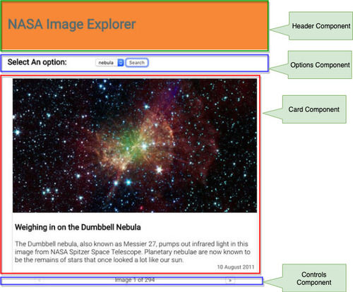

Consider this scenario. You inherit a React application or maybe revisit one of your older applications and find that while the code works fine one of your components is a bit too complicated and you wish to refactor it into a series of smaller components.

In this article we will take just such a scenario and go through the process step by step. The objective is to learn what steps are necessary and in what order to perform such a decomposition.

# The Initial Application

This is a very simple React application that fetches some images from the NASA API and allows the user to scroll through the returned images.


The entire application is written as just one component named App. The full code for this component looks like this:


```jsx
import React, { useState } from 'react';
import './App.css';
import moment from 'moment';

const App = () => {
  const [images, setImages] = useState([]);
  const [count, setCount] = useState(0);
  const [image_type, setImageType] = useState('nebula');
  const [error, setError] = useState('');
  const [page, setPage] = useState(1);
  const [currentImage, setCurrentImage] = useState(-1);

  const fetchImages = () => {
    const url = `https://images-api.nasa.gov/search?q=${image_type}&media_type=image&page=${page}`;
    fetch(url)
      .then(res => {
        if (res.ok) {
          return res.json();
        }
        throw new Error('Problems getting the data.');
      })
      .then(({ collection }) => {
        console.log(collection);
        const {
          metadata: { total_hits: count },
          items
        } = collection;

        const images = items.map(item => {
          const { center, date_created, description, title } = item.data[0];
          const { href } = item.links[0];
          return { center, date_created, description, title, href };
        });
        setCount(count);
        setImages(images);
        if (count > 0) {
          setCurrentImage(0);
        }
      })
      .catch(error => setError(error.message));
  };

  const imageCard =
    currentImage > -1 ? (
      <div className="card">
        
        <div className="card_content">
          <h3>{images[currentImage].title}</h3>

          <div className="card_description">
            {images[currentImage].description}
          </div>

          <div className="card_date">
            {moment(images[currentImage].date_created).format('DD MMMM YYYY')}
          </div>
        </div>
      </div>
    ) : (
      ''
    );

  const controls =
    currentImage > -1 ? (
      <div className="controls">
        <button
          disabled={currentImage < 1}
          onClick={e => setCurrentImage(currentImage - 1)}
        >
          &lt;
        </button>
        <div className="control_count">
          Image {currentImage + 1} of {count}
        </div>
        {currentImage < count ? (
          <button onClick={e => setCurrentImage(currentImage + 1)}>&gt;</button>
        ) : (
          ''
        )}
      </div>
    ) : (
      ''
    );

  const artifacts = ['planet', 'nebula', 'galaxy', 'pulsar'];
  const options = artifacts.map((a, i) => (
    <option value={a} key={i}>
      {a}
    </option>
  ));

  return (
    <div className="App">
      <header>
        <h1>NASA Image Explorer</h1>
      </header>
      <div className="options">
        <h3>Select An option:</h3>
        <div className="options_form">
          <select
            value={image_type}
            onChange={e => setImageType(e.target.value)}
          >
            {options}
          </select>
          <button onClick={fetchImages}> Search </button>
          {error ? <div className="error">{error}</div> : ''}
        </div>
      </div>
      <div>{imageCard}</div>
      {controls}
    </div>
  );
};

export default App;

```

As you can see this component is doing quite a lot. That is why we want to decompose it into smaller components. But what are the smaller components and how do we access teh data in the component that needs it? We will walk through those steps next.

You can clone or download this version of the code from the **starter_app** branch on [this repository](https://github.com/vramdhanie/nasa_image_explorer/tree/starter_app).

## Plan the decomposition
Our first step on the this path is to think about which areas of the UI may be refactored into their own components. What you decide is entirely up to you but there are some basic guidelines that you can follow. A component should be as single minded as possible, that is, it should be responsible for just one thing.

Here is one option  for decomposing this interface.



Let us then look at the way we can refactor the code.

## Header Component
The simplest component to work on is probably the header. This component does not require acccess to any data and in fact is debatable wether it needs to be refactored at all. We will still refactor it here as a first exercise though just to illustrate the process.

Begin by creating a new file named  `header.js` in the src folder. Create a function component and copy teh header code from App.js to the new component. It should now look like this.

```javascript
import React from 'react'

const Header = () => {
    return (
        <header>
          <h1>NASA Image Explorer</h1>
        </header>
    )
}

export default Header

```

Next, update the App component to import the Header component.

```javascript
import Header from './header'
```

And replace the `<header>` in the JSX with this new component.

```diff
    return (
      <div className="App">
-       <header>
-         <h1>NASA Image Explorer</h1>
-       </header>
+       <Header />
        <div className="options">
```

Save all files and the output should look the same. The code for this version of the app may be found in the branch named **header_component** in [the repository](https://github.com/vramdhanie/nasa_image_explorer/tree/header_component).

## Card Component
Let us then look at the card component. This one requires some data but does not require any callback props so it terms of data it is a little simpler to work with than the other two.

The full code for the card can be found in App.js. 

```javascript
      <div className="card">
        
        <div className="card_content">
          <h3>{images[currentImage].title}</h3>

          <div className="card_description">
            {images[currentImage].description}
          </div>

          <div className="card_date">
            {moment(images[currentImage].date_created).format('DD MMMM YYYY')}
          </div>
        </div>
      </div>
```

For this to work we need access to the `images[currentImage]` object. we could just pass that as a prop to the card component.

Create a new file in the src folder named `card.js` and create a function component that accepts a single prop named **image**. 
Return the JSX code as above but replace all references to `images[currentImage]. The code for `card.js` should look like this:

```javascript
import React from 'react';
import moment from 'moment';

const Card = ({ image }) => {
  return (
    <div className="card">
      
      <div className="card_content">
        <h3>{image.title}</h3>

        <div className="card_description">{image.description}</div>

        <div className="card_date">
          {moment(image.date_created).format('DD MMMM YYYY')}
        </div>
      </div>
    </div>
  );
};

export default Card;
```

Next, import Card into App.js and replace the JSX for the card with the component element. Remember to pass the image object as a prop named `image`.

```javascript
import Card from './card';
```

and 

```javascript
const imageCard = currentImage > -1 ? <Card image={images[cardImage]} /> : '';
```

Once again the application should run as before. The full code for this change can be found in the **card_component** branch of [the repo](https://github.com/vramdhanie/nasa_image_explorer/tree/card_component).