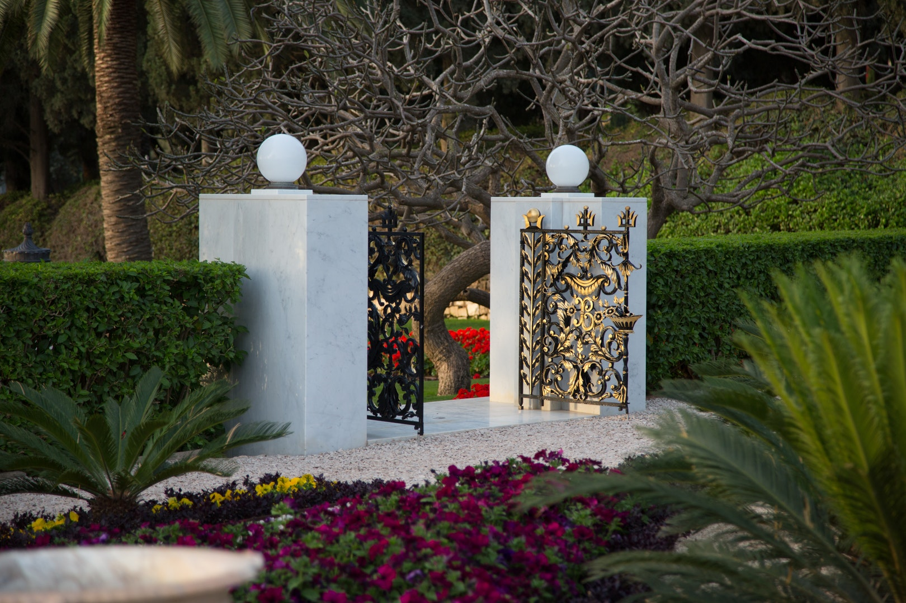

O KING of Islám! Aid thou, with the truth, after having aided the Book, Him Who is Our Most Great Remembrance, for God hath, in very truth, destined for thee, and for such as circle round thee, on the Day of Judgment, a responsible position in His Path. I swear by God, O Sháh! If thou showest enmity unto Him Who is His Remembrance, God will, on the Day of Resurrection, condemn thee, before the kings, unto hellfire, and thou shalt not, in very truth, find on that Day any helper except God, the Exalted. Purge thou, O Sháh, the Sacred Land [Ṭihrán] from such as have repudiated the Book, ere the day whereon the Remembrance of God cometh, terribly and of a sudden, with His potent Cause, by the leave of God, the Most High. God, verily, hath prescribed to thee to submit unto Him Who is His Remembrance, and unto His Cause, and to subdue, with the truth and by His leave, the countries, for in this world thou hast been mercifully invested with sovereignty, and wilt, in the next, dwell, nigh unto the Seat of Holiness, with the inmates of the Paradise of His good-pleasure.…

By God! If ye do well, to your own behoof will ye do well; and if ye deny God and His signs, We, in very truth, having God, can well dispense with all creatures and all earthly dominion.

