import { Alert, AlertIcon } from "@chakra-ui/core"

In August of 2018 Firebase announced that hosting multiple sites in the same Firebase project was possible.
This was great news for sites that shared resources.
I use Google Cloud Build to manage the deployment process of my applications to Firebase.
So I decided to make use of this new feature and attempted to modify my Cloud Build configuration
to allow deploying applications to different Firebase hosting sites in the same project.

_This took me an inordinate amount of time and effort to figure out. That might be due to my limited
understanding of the configuration. I found the existing documentation to be missing some steps.
So I decided to document my solution here._

In this article I will describe how I set up deploying two different applications to hosting sites in the same Firebase project.

## The applications

I am working on a public facing React application. Additionally,
I want to create a preview version of the application for the internal team to review changes before they are deployed to the public site.
There is a second administration application for use by the internal team to administer to the public facing application.

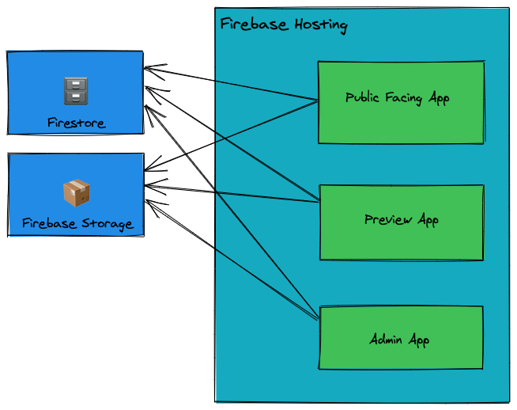

## Firebase setup

On the Firebase console create a new project by clicking _Add project_ then entering a project name when prompted.
Or alternativily, if you have an existing project that you wish to use then simply select that project. Follow the
prompts to complete the process.

If this is the first time you are setting up a Firebase project you should check the official documentation [here](https://firebase.google.com/docs/web/setup) for full details.

Very briefly, the steps to setting up a project are:

### Step 1 Project name

Enter a name for your project and optionally add a project id. We will be using this project id later so making an easy to remember id here would be beneficial.

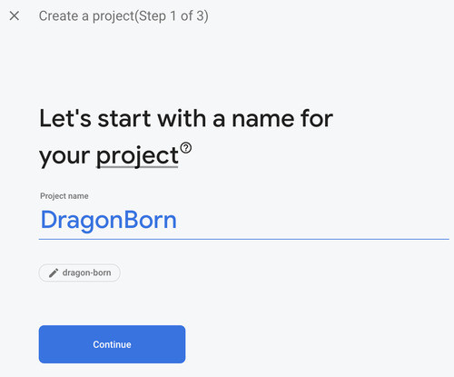

### Step 2 Enable Google Analytics

Optionally, enable Google Analytics for the project. This is recommended since you would want to track
the usage of your application after it is deployed.

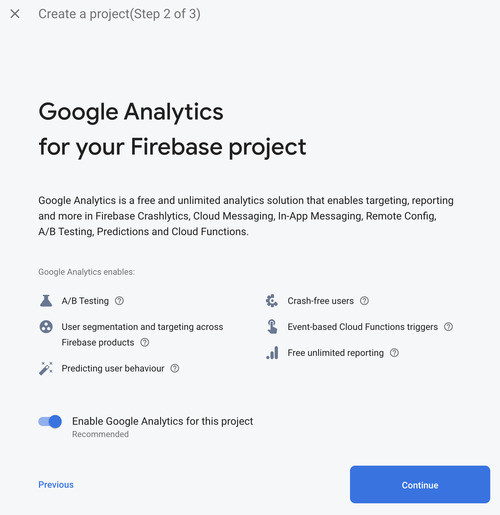

### Step 3 Select Analytics account

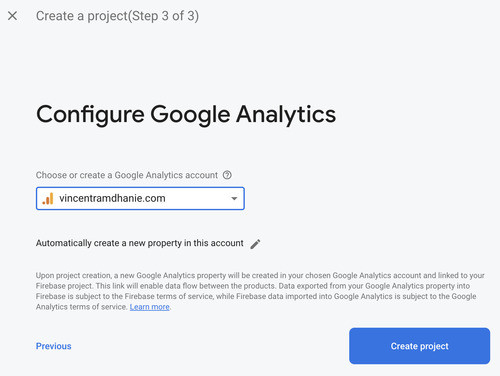

If you enabled Google Analytics in the previous step then you need to either create or select an existing Google Analytics account.

### Step 4 Project creation

Wait a few moments while the project is created.

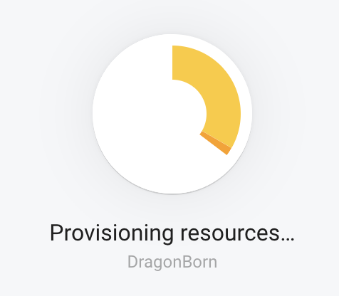

### Step 5 Done

Congratulations! You have a new Firebase project. Click the **Continue** button.

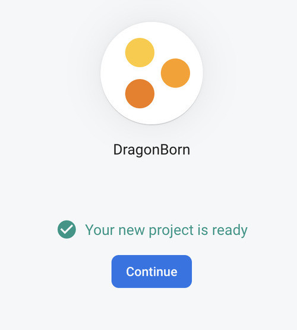

## Hosting

Setting up hosting on your Firebase project is fairly straightforward. From your dashboard select **Hosting**.
Then click on the **Get started** button. This starts a wizard that walks through the steps of setting up hosting.

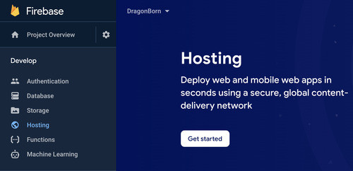

### Step 1 Install Firebase CLI

We will use the Firebase CLI to initialize and deploy the application on Firebase. The CLI is available as an `npm` package.
Since we are learning about the setup you should click the checkbox labelled "Also show me the steps to add the Firebase JavaScript SDK...".
We are not actually going to use this right now but it would be interesting to see how the SDK is added to a project. Feel free to skip this.

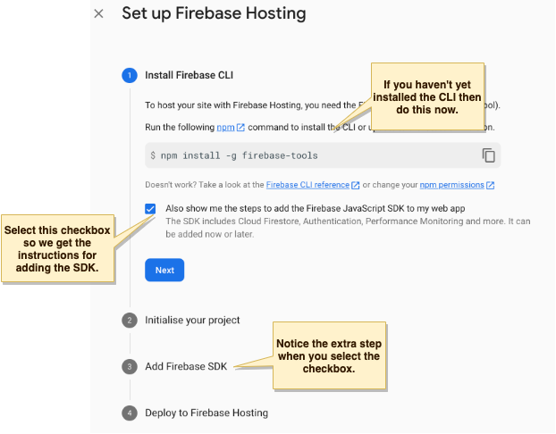

After running the `npm` command to install the Firebase CLI you can check that the installation worked by running

```bash
firebase --version
```

### Step 2 Initialise project

The next step involves initializing Firebase in your project.

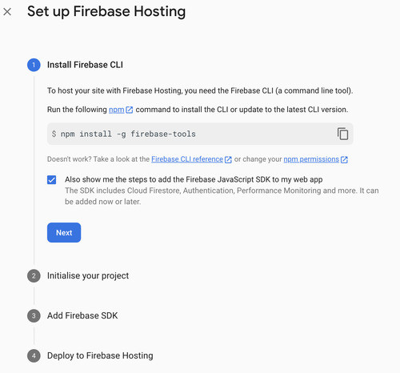

From the root directory of your application run the command:

```bash
firebase login
```

If you are not already logged in then you are directed to log in with your Google credentials. Once logged in initialize the project with the command:

```bash
firebase init
```

This is a multi step process. First you are asked to decide which Firebase service you wish to initialize. Use the arrow keys to navigate through the list and press the `space` bar to select a feature.

```
 ◯ Database: Deploy Firebase Realtime Database Rules
 ◯ Firestore: Deploy rules and create indexes for Firestore
 ◯ Functions: Configure and deploy Cloud Functions
❯◉ Hosting: Configure and deploy Firebase Hosting sites
 ◯ Storage: Deploy Cloud Storage security rules
 ◯ Emulators: Set up local emulators for Firebase features
```

While you can select multiple features we are only interested in hosting at this moment. Select hosting and hit `enter`.

Next, you are prompted to select a project.

```
=== Project Setup

First, let's associate this project directory with a Firebase project.
You can create multiple project aliases by running firebase use --add,
but for now we'll just set up a default project.

? Please select an option: (Use arrow keys)
❯ Use an existing project
  Create a new project
  Add Firebase to an existing Google Cloud Platform project
  Don't set up a default project
```

As you can see you have the choice of creating a new project or using an existing one. We already created a project so let us use that project.
Hit `enter` to use an existing project. A list of projects is presented and you can scroll through and select the one you want.

```
? Select a default Firebase project for this directory:
  bahaitt (bahaitt)
  bahaitt-preview (bahaitt-preview)
  debbie-fe89b (debbie)
❯ dragon-born (DragonBorn)
  facebook-for-rabbits (rabbitbook)
  uber-for-babies (buber)
  netflix-for-parrots (petflix)
(Move up and down to reveal more choices)
```

Navigate to your project and hit `enter`.

Next, we are asked to specify a directory that will contain the files we want to deploy to Firebase. In a React application the files that are built for deployment are placed in a directory named _build_.

```
=== Hosting Setup

Your public directory is the folder (relative to your project directory) that
will contain Hosting assets to be uploaded with firebase deploy. If you
have a build process for your assets, use your build's output directory.

? What do you want to use as your public directory? build
```

Enter the name of your build output directory and hit `enter`.

Your React application is a single page application. That is, the client only loads a single page at `index.html`
and your entire application runs from that location. Even if the added a path to the URL of your application
you will still only want the `index.html` file to load and your router will handle the path. To Configure
the application as a single page application all paths must be redirected to `index.html`.

```
? Configure as a single-page app (rewrite all urls to /index.html)? (y/N) Y
```

Type Y and hit `enter`.

At this point you should see output similar to this:

```
✔  Wrote build/index.html

i  Writing configuration info to firebase.json...
i  Writing project information to .firebaserc...

✔  Firebase initialization complete!
```

Note that an `index.html` file was created because the build directory was empty. This file is not important and will be overwritten
the next time the project is built. If you already have files in the build directory you will probably be prompted tooverwrite the files or not. It is safe to not overwrite the files.

Two files were created at the root of your project: _firebase.json_ and _.firebaserc_. The _firebase.json_ file contain project configurations
for your project such as the rewrite rules and the public directory. The _.firebaserc_ file contain some project specific
information for use by the firebase CLI internally. Usually the _.firebaserc_ file is added to the _.gitignore_ file list.
Firebase will also create a hidden directory named _.firebase_ where data internal to the firebase processes are stored. We should also add this directory to _.gitignore_.

Edit the _.gitignore_ file and add the following lines:

```sh
# firebase
.firebaserc
.firebase/
```

When you are done click **Next** on the Firebase Hosting wizard.

### Step 3 Add Firebase SDK

This is an optional step at this point. If you needed to add the SDK to your project you may follow the steps outlined here.
This was only included for informational purposes. Feel free to just hit **Skip this step**.

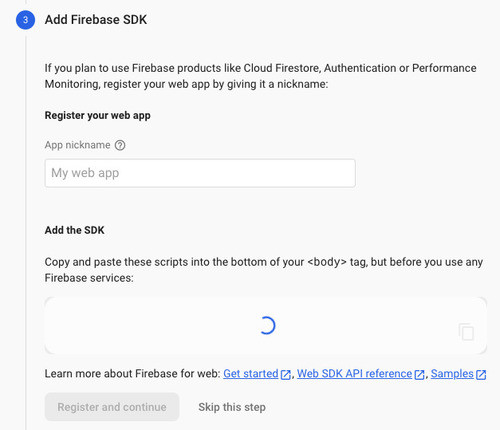

### Step 4 Deploy the project

Now that the Firebase hosting has been configured for your project you can deploy it with the Firebase CLI.
Before you deploy you need to build the project.

```bash
npm run build
```

Then run the command:

```bash
firebase deploy
```

This process takes a few seconds. You should see output similar to this:

```
➜  dragon-born git:(master) ✗ firebase deploy

=== Deploying to 'dragon-born'...

i  deploying hosting
i  hosting[dragon-born]: beginning deploy...
i  hosting[dragon-born]: found 19 files in build
✔  hosting[dragon-born]: file upload complete
i  hosting[dragon-born]: finalizing version...
✔  hosting[dragon-born]: version finalized
i  hosting[dragon-born]: releasing new version...
✔  hosting[dragon-born]: release complete

✔  Deploy complete!

Project Console: https://console.firebase.google.com/project/dragon-born/overview
Hosting URL: https://dragon-born.web.app
```

Now visit your website at the automatically provisioned domain name. Also, take a look at the Firebase console, it will reflect this deployment.

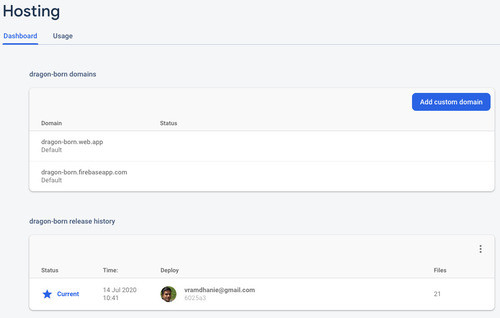

## Google Cloud Build

The next step is to automate this deployment using Google Cloud Build. We can configure the Cloud Build
to trigger a deployment whenever there is activity on a branch on your Git repository on Github.

Start by visiting the [Google Cloud Build console](https://console.cloud.google.com/) and selecting your project. If Cloud Build was never enabled for your project you will be prompted to enable the Cloud Build API.

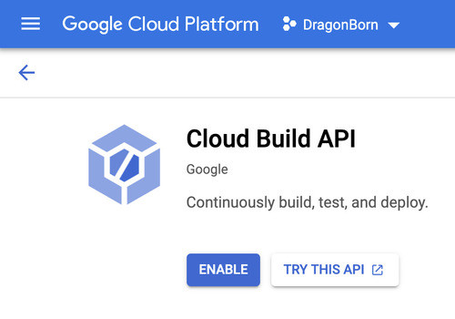

Click the **Enable** button to get started. You will be prompted to enable billing.

<Alert status="info">
  <AlertIcon />
  You must enable billing to use Google Cloud Build. However, the free tier is generous
  and it is unlikely that you will be charged anything just for this test.
</Alert>

After enabling billing go back to the Cloud Build console and click on the **Triggers** page.

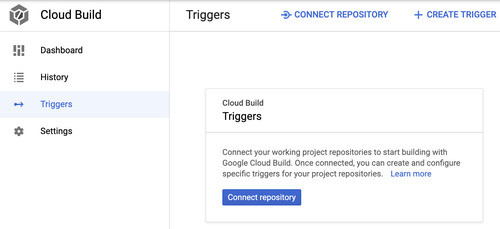

### Connecting your repository

Before we create a trigger we need to connect Cloud Build to the repository and authenticate Cloud Build on Github. To get started click the **Connect repository** button.

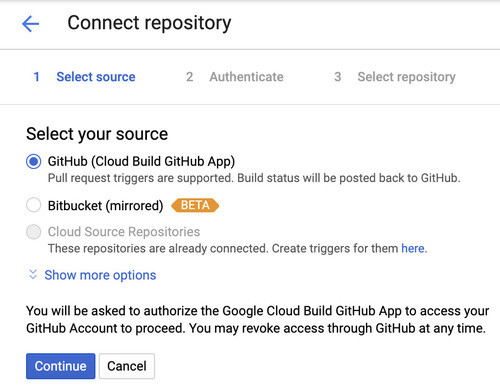

Select Github on the first screen. Note that in the next step you will have to authenticate against Github and select the repository for your project. Ensure
that you have your Github credentials handy and that you have created the repository for your project on Github. Click the **Continue** button when ready.

If you have previously authenticated Cloud Build on Github you may see a list of repositories on the page. If your project repository is not on the page
you can click on the **Edit repositories on Github** link.

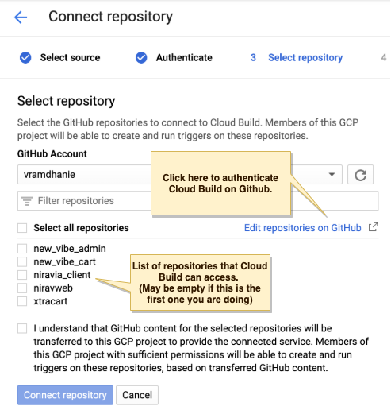

This opens a new window on the Github login page. Enter your credentials and you will be taken to the _Settings/Applications_ page on Github.
On this page you will give Cloud Build access to one or more repsoitories.

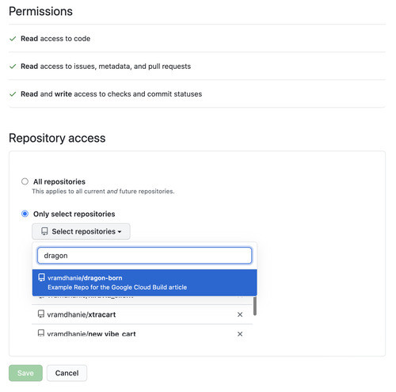

Ensure that at least your project is selected then click the **Save** button. Back on the Cloud Build console you should then see your project listed.
Select the project, check the box to indicate you understand that Cloud Build will be accessing your Github project then click the **Connect repository** button.
On the next page click the **Skip for now** button. We will walk through the process of creating the trigger next.

### Create a Trigger

To get started creating a trigger click the **+ Create trigger** button.

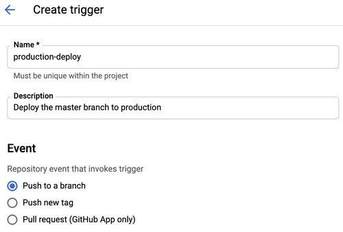

Enter a name for the trigger and a short description. The first trigger that we are creating is the production deploy trigger that will deploy anything we push to the master branch. Ensure that the event
that invokes the trigger is set to _Push to a branch_.

Next, select the Github repository and ensure that the branch is defined by a regular expression. We are trying to select only the master branch here.

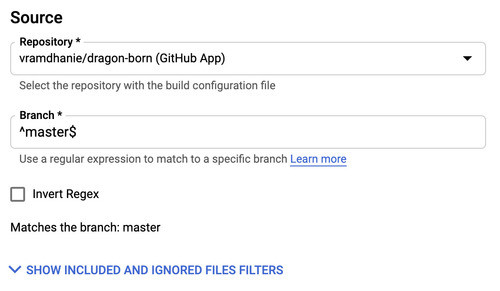

#### The build configuration file

In the next section select **Cloud Build configuration file (YAML or JSON)**. That is, we are going to create a new configuration file detailing how to deploy the application.
We are free to name this file whatever we want but we can stick with the default **cloudbuild.yaml**.

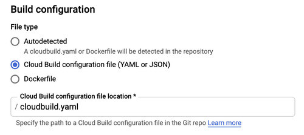

We need to create this file in the root of the project. Create a new file named **cloudbuild.yaml**. Add the following code to the file.

```yaml
steps:
  - name: node
    entrypoint: yarn
    args: ["install"]
  - name: node
    entrypoint: yarn
    args: ["add", "firebase-tools"]
  - name: node
    entrypoint: yarn
    args: ["build"]
  - name: node
    entrypoint: "./node_modules/.bin/firebase"
    args: ["deploy", "--project", "$PROJECT_ID", "--token", "$_TOKEN"]
```

This file is fairly straightforward. It defines four steps in the deployment process.

The first step installs the dependencies listed in your _package.json_ file. The second step installs the Firebase-CLI. The third step performs a build and the
final step runs the same `firebase deploy` command that we did earlier. This final step however is dependant on two variables: `$PROJECT_ID` and `$_TOKEN`.

The `$PROJECT_ID` variable is a built in substitution that is available on the Cloud Build environment. It contains the id of the current project. You can read more about how these variable
substitutions work on the [documentation](https://cloud.google.com/cloud-build/docs/configuring-builds/substitute-variable-values).

The `$_TOKEN` variable is a custom value that we need to set. It refers to an authentication token that Firebase uses to verify that Cloud Build has access to the Firebase project.

#### Getting an authentication token

To get an authentication token for Cloud Build we go back to the terminal and use the Firebase CLI. In the root of the project run the command:

```bash
firebase login:ci
```

This will open your browser and prompt you to login with your Google account. Ensure that you login with the same account that owns the project.
Once you enter your credentials and login you can close the browser window. The token will be displayed in the terminal.

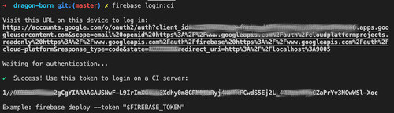

Copy the authentication token provided and return to the Cloud Build page. Under the **Substitution variables** heading click the **Add Variable** button.
Enter the name `_TOKEN` under Variable and paste the authentication token in the Value box.

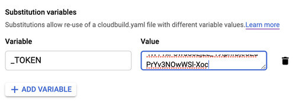

Finally click the **Create** button. At this point the trigger will be activated if any commits are pushed to the master branch of your repository on Github.
You can test that by making a small commit and pushing it. On the Cloud Build dashboard you can see the activity of the trigger on the **History** page.

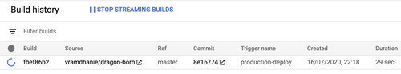

Click on the build number link to see the progress of the build. Providing each step is successful you should see output similar to the following screenshot. Additionally the log output would be displayed.

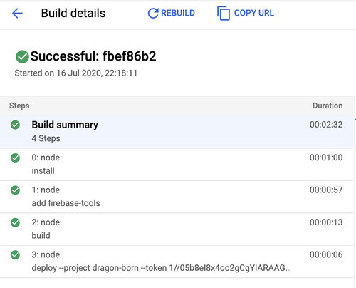

At this point we have the project auto deploying to the Firebase hosting site. The next step is to setup an alternative hosting site and deploy the preview version of the site to the alternative site.

## Multiple sites
